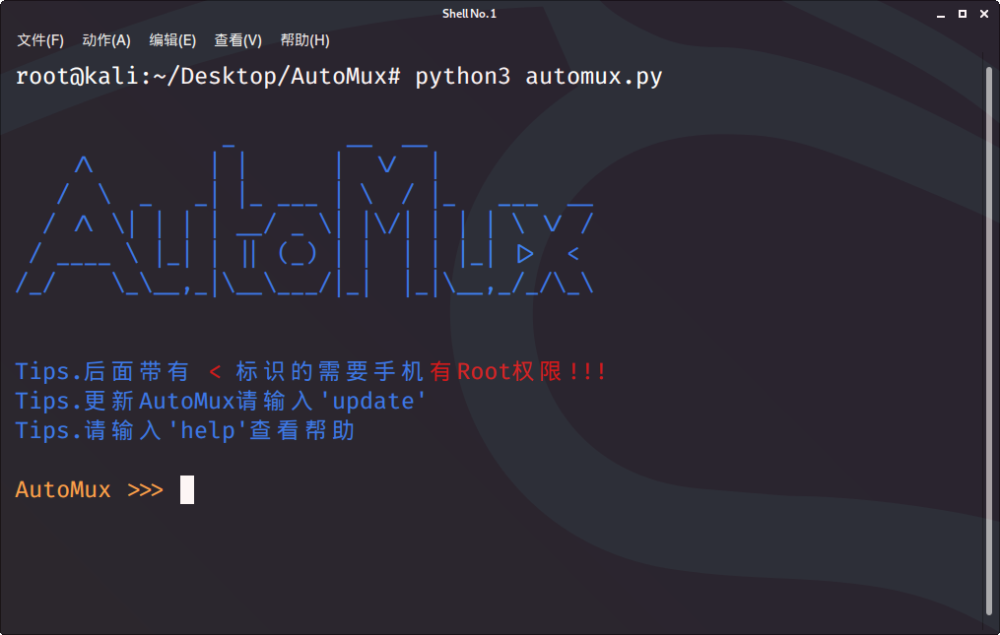

# AutoMux
本工具是为了懒人更便捷的配置Termux所写.

## 截图

### 依赖
> > Python 3.X
> > > termcoler

#### 安装和使用方法
懒人安装方法: 
> > curl https://raw.githubusercontent.com/Bcap03/AutoMux/master/install.sh | bash 
手动安装方法: 
> > git clone https://github.com/Bcap03/AutoMux.git 
> > cd AutoMux 
> > python automux.py 
> > Tips:如果想要在任何地方输入automux就能启动本程序，请继续下面的步骤
> > chmod +x install.sh 
> > ./install.sh 
> > automux 
